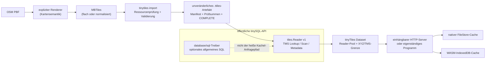

# tinyTiles

[Englische Fassung](README.md)

`tinyTiles` ist ein auf den Produktionseinsatz ausgerichtetes Werkzeugpaket zum
Erstellen, Prüfen, Ausliefern und Synchronisieren schreibgeschützter
Kachelsätze. Es wandelt eine MBTiles-Quelle in ein portables
`.ttiles`-Verzeichnis mit dem paginierten Index von tinySQL um und stellt ein
separates Offline-Cache-Protokoll für native Clients und WebAssembly bereit.

Es beansprucht bewusst **keine** vollständige MBTiles-Kompatibilität. MBTiles
ist ein SQLite-Containerformat; `.ttiles` ist ein eigenes, unveränderliches
Auslieferungsartefakt. MBTiles bleibt das interoperable Ausgabeformat für den
Erstellungsprozess; tinyTiles wird dort eingesetzt, wo ein geprüfter Lesepfad
ohne SQLite sinnvoll ist.

## Enthaltene Funktionen

- begrenzter MBTiles-Import für flache `tiles`- und normalisierte
  `map/images`-Quellen;
- exakte TMS-Punkt- und Bereichsabfragen über die öffentliche tinySQL-API;
- atomare Veröffentlichung von `.ttiles` und vollständige Prüfung nach dem
  Schreiben;
- selbstständige OSM-PBF → MBTiles → `.ttiles`-Erzeugung mit einer kompakten,
  straßenorientierten Vektorschicht, einer optionalen `postal_code`-
  Grenzschicht aus `boundary=postal_code`-Relationen und Visvalingam-Whyatt-
  Geometrievereinfachung (im Stil von mapshaper.org); reichhaltigere
  kompatible Erzeuger bleiben optional;
- ein importierbares, nebenläufiges `Dataset`, ein einhängbarer HTTP-Server
  und ein kleines eigenständiges Serverprogramm mit automatischer Ableitung von
  Vektor-/Raster-MIME-Typen und URL-Endungen, einem automatisch erzeugten
  MapLibre-GL-Style unter `/style.json`, einer optionalen Postleitzahl-Suche/
  Rückwärtssuche sowie dauerhaften Caches für native Clients und
  Browser-IndexedDB;
- ein generischer Gebietsersteller (`tinytiles territory`), der Postleitzahlen
  oder beliebige andere Polygondaten — per Präfix oder einer frei wählbaren
  CSV/JSON-Zuordnung — zu aufgelösten Vertriebs-, Außendienst- oder
  Liefergebieten gruppiert, mit GeoJSON-/TopoJSON-/CSV-Export und einer
  Power-BI-Voreinstellung;
- reproduzierbare Tests, Race Checks, WASM-Kompilierung, Benchmarks und
  Beispiele.

## Funktioniert gut mit

tinyTiles ist bewusst eine schmale Schicht. Es tritt in keine Konkurrenz zu
den folgenden Werkzeugen — es existiert, damit deren Ergebnis einen kleinen,
schnellen, validierten Lesepfad bekommt, sobald man es bereits hat.

- **[OpenStreetMap](https://www.openstreetmap.org)** ist die von der
  Community gepflegte Quelldaten hinter den meisten Kachelsätzen, die
  tinyTiles ausliefert. `tinytiles build` verarbeitet dessen `.osm.pbf`-
  Exportformat direkt mit dem eingebauten Minimal-Erzeuger — siehe
  [PBF-Build](#pbf-build).
- **[Geofabrik](https://download.geofabrik.de)** veröffentlicht täglich
  aktualisierte `.osm.pbf`-Extrakte für jedes Land und viele Teilregionen und
  ist die Standardquelle für eine `tinytiles build`-Eingabe. Interne
  Reader-Benchmarks nutzen durchgängig einen Geofabrik-Extrakt, vom Download
  bis zum veröffentlichten Artefakt.
- **[tippecanoe](https://github.com/felt/tippecanoe)** ist der De-facto-
  Standard-Vektorkachel-Generator für GeoJSON. Sein MBTiles-Output wird
  unverändert importiert; sein PMTiles-v3-Output wurde während der
  Entwicklung zur Verifikation des PMTiles-Importpfads genutzt (siehe
  [PMTiles-Quellen](#pmtiles-quellen)).
- **[PMTiles](https://github.com/protomaps/PMTiles)**-Archive — von
  tippecanoe, `pmtiles convert` oder jedem anderen v3-Erzeuger — werden
  direkt mit `tinytiles import` importiert; siehe
  [PMTiles-Quellen](#pmtiles-quellen). Die `pmtiles`-CLI und
  [pmtiles.io](https://pmtiles.io) eignen sich, um ein Archiv vor dem Import
  zu inspizieren.
- **[MapLibre GL JS](https://maplibre.org)**, Mapbox GL JS, OpenLayers und
  deck.gl konsumieren alle das TileJSON, das tinyTiles unter
  `/tilejson.json` ausliefert, einschließlich `vector_layers`/`tilestats`
  für ein Vektor-Tileset und `encoding` für eine Raster-DEM-Geländequelle.
  `/style.json` geht einen Schritt weiter und liefert einen einsatzbereiten
  MapLibre-GL-Style — mit Zeichenregeln für genau die Schichten, die das
  Dataset tatsächlich enthält —, geprüft durch das Laden in einer echten
  MapLibre-GL-JS-Karte während der Entwicklung, nicht nur per JSON-Schema.
- **[QGIS](https://qgis.org)** kann einen tinyTiles-Endpunkt direkt als
  Vektor- oder Raster-Kachelebene über seinen TileJSON-/XYZ-Verbindungsdialog
  hinzufügen — nützlich, um ein veröffentlichtes Artefakt ohne eigenen
  Client-Code zu prüfen.

## Schnellstart

Für Import, PBF-Build und SQLite-Vergleich wird das optionale
SQLite-Importer-Build-Tag von tinySQL benötigt. Ein Server, der nur ein bereits
veröffentlichtes `.ttiles`-Artefakt öffnet, bindet SQLite weder ein noch öffnet
er es:

```bash
make build
./dist/tinytiles import --min-free 0 region.mbtiles region.ttiles/
./dist/tinytiles validate region.ttiles/
./dist/tinytiles inspect region.ttiles/
```

Auf einem Deployment- oder Wiederherstellungsrechner, der nur ein
veröffentlichtes Artefakt liest, lässt sich stattdessen die kleinere CLI ohne
SQLite bauen:

```bash
make build-reader-cli
./dist/tinytiles-reader validate region.ttiles/
./dist/tinytiles-reader tile region.ttiles/ 8 137 167 > tile.pbf
```

Die Befehle `validate`, `inspect` und `tile` funktionieren ohne SQLite.
`build`, `import` und `benchmark` geben dort absichtlich einen eindeutigen
Build-Tag-Fehler zurück.

Eine Offline-Straßenkarte lässt sich direkt aus PBF bauen:

```bash
./dist/tinytiles build \
  --minzoom 8 --maxzoom 14 \
  --max-memory $((256 * 1024 * 1024)) \
  region.osm.pbf region.ttiles/
```

Der eingebaute Erzeuger schreibt die MVT-Schichten `transportation` (große
Straßen, Straßen und Wege), `building`, `water` und `landcover` (Wald, Felder,
Wiesen und Obst-/Weinanbau). Er enthält absichtlich keine Luftbilder, POIs oder
Beschriftungen; ein lokaler MapLibre-Stil rendert die Schichten. Für sehr große
Extrakte oder einen reichhaltigeren Kachelsatz kann `--generator` weiterhin
explizit auf ein kompatibles lokales Programm verweisen.

Die kompakte erste Version verarbeitet dafür geschlossene OSM-Wege. Komplexe
Multipolygon-Relationen bleiben bewusst dem optionalen reichhaltigeren
Erzeuger vorbehalten.

Die Flags `--building-minzoom`, `--shards`, `--shard-compression`,
`--reduce-concurrency`, `--districts` sowie die geografischen Filter gelten
nur für einen explizit gewählten externen Erzeuger.

Dasselbe Flag `--compact` steht bei `tinytiles build` zur Verfügung; es
dedupliziert die erzeugten MBTiles nur für den abschließenden `.ttiles`-Import
und verändert keine mit `--mbtiles-out` angeforderte Datei.

## Architektur



Das serverseitige Dataset und der Browser-Cache haben absichtlich
unterschiedliche Speicherformate. Ein Browser öffnet weder SQLite noch
tinySQL-Seitendateien, sondern speichert begrenzte einzelne TMS-Kacheln unter
einem versionierten Cache-Namensraum. Das macht den Web-Pfad portabel und
verhindert, dass interne Server-Persistenz in einen Client ausgeliefert wird.

## Begriffe, Abkürzungen und GIS-Grundlagen

Die Befehle, Dateinamen und API-Namen in dieser README bleiben absichtlich bei
ihren üblichen englischen Schreibweisen. Dieses Glossar erklärt sie auf Deutsch.
Es trennt außerdem Begriffe, die im Kartenbereich ähnlich klingen, aber etwas
anderes meinen: Koordinatenschema, Projektion, Datenformat, Cache-Zustand und
Messmethode sind voneinander unabhängig.

### Karte, Kachel und Koordinaten

| Begriff | Bedeutung in tinyTiles |
|---|---|
| **GIS** (Geoinformationssystem) | Software und Daten zur Erfassung, Verarbeitung und Darstellung räumlicher Informationen. tinyTiles speichert und liefert Kartendaten; es legt weder ein Kartendesign noch eine GIS-Fachlogik fest. |
| **Kachel** | Ein rechteckiger Ausschnitt eines Kartenrasters. Ein Kachelsatz ist meist *spärlich*: Nicht jede theoretische Koordinate enthält tatsächlich eine Kachel. |
| **Kachelkoordinate `(z, x, y)`** | Die Adresse einer Kachel im Raster, nicht Länge/Breite und nicht Pixelkoordinaten. `z` ist die Zoomstufe, `x` die Spalte und `y` die Zeile. |
| **Zoomstufe (`z`)** | Detailstufe des Rasters. Im üblichen globalen Webkartenraster verdoppelt jede höhere Stufe die Zahl der Spalten und Zeilen; dadurch gibt es etwa viermal so viele mögliche Kacheln und feinere Details. |
| **TMS** (Tile Map Service) | Ein Zählschema für Kachelzeilen: Ursprung unten links, `y` wächst nach Norden. tinyTiles speichert und liest seine Koordinaten in TMS. |
| **XYZ** | Das heute bei vielen Webkarten-URLs gebräuchliche Zählschema: Ursprung oben links, `y` wächst nach Süden. Bei gleicher Zoomstufe und Spalte unterscheiden sich TMS und XYZ nur in der Zeile. `LookupXYZ` rechnet diese Zeile genau einmal um; `LookupTMS` nicht. |
| **Zeilen-Flip** | Die Umrechnung zwischen TMS und XYZ: Bei einem vollständigen Raster der Zoomstufe `z` ist `y_tms = 2^z - 1 - y_xyz`. Ein falscher Flip liefert oft eine plausible, aber spiegelverkehrte Kachel. |
| **WGS84** (World Geodetic System 1984) | Weltweit gebräuchliches geografisches Bezugssystem für Breiten- und Längengrade. `PrefetchRoute` nimmt WGS84-Punkte entgegen und wandelt sie für die gewünschte Zoomstufe in Kacheln um. |
| **Breite/Länge (latitude/longitude)** | Geografische Position in Grad: Breite ist Nord/Süd, Länge Ost/West. Sie sind keine `x/y`-Kachelkoordinaten. |
| **Web Mercator** | Die für Webkarten sehr verbreitete Kartenprojektion hinter vielen XYZ/TMS-Rastern. TMS und XYZ sind selbst keine Projektionen; der Generator bestimmt, wie Quelldaten in sein Kachelraster projiziert werden. |
| **Räumlicher Bereich** | Eine Abfrage eines rechteckigen Bereichs aus mehreren Kachelkoordinaten. Sie ist etwas anderes als ein geografischer Umkreis, auch wenn beide auf der Karte ähnlich aussehen können. |
| **Route rasterisieren** | Eine Linie aus WGS84-Routenpunkten in die Kacheln übersetzen, die sie kreuzt. tinyTiles rendert dabei kein Bild, sondern ermittelt nur die zu lesenden Kacheladressen für das Vorladen. |

### Quellen, Datenformate und Darstellungen

| Begriff | Bedeutung |
|---|---|
| **OSM** (OpenStreetMap) | Gemeinschaftlich gepflegte Geodaten, zum Beispiel Wege, Gebäude und Eigenschaften. OSM ist Quelldatenbestand, keine fertige Kartenoptik. |
| **PBF** (Protocol Buffers) | Binäre Kodierung strukturierter Daten. Eine Datei `.osm.pbf` enthält OSM-Quelldaten. Das `pbf`-Format einer Vektorkachel verwendet ebenfalls Protocol Buffers, ist aber eine bereits für Karten vorbereitete Kachel und nicht dieselbe Art von Inhalt. |
| **MBTiles** | Ein verbreiteter Container für Kacheln auf Basis einer SQLite-Datenbank. tinyTiles nutzt MBTiles als interoperables Bau- und Austauschformat, nicht als eigenes Auslieferungsformat. |
| **SQLite / SQL** | SQLite ist eine eingebettete Datenbank; SQL (Structured Query Language) ist ihre Abfragesprache. Die Import- und Vergleichswerkzeuge lesen SQLite, der normale `.ttiles`-Lesepfad nicht. |
| **`.ttiles`-Artefakt** | Das unveränderliche Auslieferungsverzeichnis von tinyTiles: ein paginierter tinySQL-Speicher mit Indexen, Manifest und Integritätsdateien. Es ist kein MBTiles-Standard und soll MBTiles nicht ersetzen. |
| **Generator / Renderer / Kartenstil** | Das externe Generatorprogramm wählt OSM-Objekte aus, erzeugt Kacheln und legt bei Vektorkacheln Layer- und Stilsemantik fest. tinyTiles importiert und liefert dessen Ergebnis; es erfindet keinen Stil. |
| **Vektorkachel / MVT** | Eine **MVT** (Mapbox Vector Tile) enthält Geometrien, Layer und Attribute, die ein Client nach einem Stil zeichnet. Sie kann etwa Straßen und Gebäude als Daten statt als Pixel liefern. |
| **Rasterkachel** | Bereits gerenderte Pixel, etwa PNG (Portable Network Graphics), JPEG/JPG (Joint Photographic Experts Group), WebP oder AVIF (AV1 Image File Format). Luftbilder sind typischerweise Rasterkacheln. Das Dateiformat beeinflusst MIME-Typ und URL-Endung, nicht das TMS/XYZ-Schema. |
| **Layer, Feature, Geometrie, Attribut** | Bestandteile einer Vektorkachel: Ein Layer gruppiert Inhalte; ein Feature ist zum Beispiel eine Straße; seine Geometrie beschreibt Form und Lage, Attribute beschreiben Eigenschaften wie Name oder Klasse. |
| **Payload / BLOB** | Die tatsächlichen Binärbytes einer Kachel. **BLOB** bedeutet „Binary Large Object“, also ein Datenfeld für beliebige Bytes. tinyTiles gibt den Payload unverändert zurück. |
| **Metadaten** | Schlüssel/Wert-Informationen über den Satz, etwa Kachelformat oder Name. Sie sind nicht der Inhalt einer einzelnen Kachel. |
| **MIME-Typ / Content-Type** | MIME (Multipurpose Internet Mail Extensions) ist die HTTP-Kennung dafür, wie ein Client Bytes behandeln soll, zum Beispiel `image/png` oder `application/vnd.mapbox-vector-tile`. Der Server leitet sie normalerweise aus dem MBTiles-Format ab. |

### Speicherlayout, Import und Integrität

Ein **Schema** ist die physische Anordnung derselben logischen Kacheln. Die
Auswahl ändert weder die Koordinaten noch die Bytes, die eine gültige Kachel
zurückliefert.

| Form | Aufbau | Wann sie sinnvoll ist |
|---|---|---|
| **flat / `tiles`** | Eine Koordinate verweist direkt auf ihren Payload. | Wenige oder keine gleichen Payloads; ein Lookup braucht einen Indexweg weniger. |
| **normalized / `map/images`** | `map` ordnet Koordinaten einer `tile_id` zu; `images` ordnet diese ID dem Payload zu. | Mehrere Koordinaten teilen exakt denselben Payload. Das vermeidet doppelte Speicherung. |

- **`tile_id`:** Kennung (ID, *identifier*) eines Payloads in einer
  normalisierten Quelle. Sie ist nur dann wiederverwendbar, wenn mehrere
  Koordinaten wirklich dieselben Bytes liefern.
- **Deduplizierung:** Gleiche Payloads werden einmal gespeichert und von
  mehreren Koordinaten referenziert. **`--compact`** führt diese verlustfreie
  Inhalts-Deduplizierung beim Import aus. „Verlustfrei“ heißt hier bytegenau:
  Jede Koordinate gibt exakt dieselben Bytes wie die Quelle zurück, nicht nur
  ein optisch gleiches Bild.
- **`--schema auto`:** Wählt die flache Form, wenn eine normalisierte Quelle
  keine wiederverwendete `tile_id` besitzt; andernfalls bleibt sie
  normalisiert. Normalisiert ist daher nicht pauschal kleiner oder schneller.
- **Komprimierung:** Verkleinert Bytes durch ein Kodierungsverfahren.
  Deduplizierung entfernt dagegen nur bereits vorhandene identische Kopien.
  Die temporäre **Shard-Komprimierung** betrifft Arbeitsdateien des Generators,
  nicht die inhaltliche Genauigkeit einer Kachel. Eine **SSD** ist ein schnelles
  Solid-State-Laufwerk ohne rotierende Platte; unkomprimierte Shards tauschen
  mehr temporären SSD-Platz gegen weniger Entpackarbeit.
- **Batch:** Begrenzte Gruppe von Importzeilen, die zusammen verarbeitet wird.
  Sie begrenzt das Arbeitsspeicher-**Working Set**, also die gerade benötigte
  Datenmenge, statt die gesamte Quelle in den **RAM** (Random Access Memory,
  Arbeitsspeicher) zu laden.
- **Shard:** Zeitweilige Teilmenge/Teil-Datei der Generatorarbeit. Shards
  ermöglichen begrenzten Speicherbedarf und parallele Verarbeitung.
- **Vorabprüfung / Ressourcen-Schranke:** Prüfung von reserviertem freiem
  Speicherplatz und Arbeitsspeicher vor dem Start. Sie verhindert, dass ein
  Import die Maschine erst während des Schreibens erschöpft.
- **Index, B-Tree, Seite und Pager:** Ein Index findet eine Koordinate ohne
  lineares Durchsuchen aller Zeilen. tinySQL legt Indexe in festen
  Datei-**Seiten** ab; der **Pager** liest und cached diese Seiten. Ein
  **B-Tree** ist die dafür übliche baumförmige Indexstruktur. Passt ein großer
  BLOB nicht in eine Seite, können **Overflow-Seiten** seine Fortsetzung
  enthalten.
- **Hash-Index:** Ein temporärer Index über einen kurzen Hash/Fingerabdruck,
  der beim Kompakt-Import gleiche Payload-Kandidaten schnell findet. Vor einer
  Wiederverwendung prüft tinyTiles zusätzlich die vollständigen Bytes, damit
  eine zufällige Hash-Kollision keine falsche Deduplizierung erzeugt.
- **Reader und Reader-Pool:** Ein Reader ist ein unabhängiger Lesezugriff samt
  Seiten-Cache. Ein `Dataset` bündelt eine begrenzte Zahl solcher Reader,
  damit mehrere Anfragen parallel lesen können. Die Reader-Zahl ist ein
  Parallelitäts- und Speicherbudget, nicht automatisch eine Zahl von
  CPU-Kernen (CPU = Central Processing Unit, also Prozessor).

Ein Artefakt wird erst nach einer vollständigen **Validierung** veröffentlicht:

- **Manifest:** Maschinenlesbare Beschreibung von Version, Schema, Umfang,
  Quelle und Konfiguration eines Artefakts.
- **Herkunftsnachweis:** Die im Manifest festgehaltenen Angaben, aus welchen
  Eingaben und mit welcher Generator-Konfiguration das Artefakt entstanden
  ist. Sie enthalten absichtlich keine maschinenlokalen Pfade.
- **Digest / Prüfsumme / SHA-256:** Ein Digest ist ein fester Fingerabdruck von
  Bytes; SHA steht für Secure Hash Algorithm, die 256 für die 256 Bit des
  verwendeten Hash-Verfahrens. Prüfsummen erkennen Übertragungs- und
  Speicherkorruption, wenn der erwartete Wert vertrauenswürdig ist. Sie ersetzen
  keine Signatur oder Zugangskontrolle: Wer Manifest und Prüfsummen gemeinsam
  austauschen kann, könnte auch beide verändern.
- **`COMPLETE`:** Markierungsdatei, die erst nach erfolgreicher Validierung
  geschrieben wird. Fehlt sie, behandeln Reader das Verzeichnis als
  unvollständig.
- **Unveränderlich:** Ein veröffentlichtes Artefakt wird nicht an Ort und
  Stelle geändert. Eine neue Version entsteht separat als neue **Revision**.
- **Atomare Veröffentlichung:** Nach Validierung wird das neue
  Geschwisterverzeichnis per `rename` sichtbar gemacht, sodass Leser entweder
  die alte oder die neue Version sehen, nicht einen Zwischenstand. `fsync`
  fordert das Betriebssystem auf, fertig geschriebene Daten dauerhaft
  abzulegen; es ist ein zusätzlicher Haltbarkeitsschritt, aber keine pauschale
  Stromausfallgarantie für jede Dateisystem- und Hardwarekombination.
- **`--replace` und Rollback-Kandidat:** `--replace` erlaubt den Austausch
  eines bestehenden Ziels. Die vorige Version bleibt bis zur erfolgreichen
  Veröffentlichung als mögliche Rückfallversion erhalten.

### Lesen, Cache und Benchmark-Latenz

**Latenz** ist die Dauer einer einzelnen Anfrage. Sie ist nicht dasselbe wie
**Durchsatz** (wie viele Anfragen ein System pro Zeitspanne schafft). Ein
**Anfragekorpus** ist die festgelegte Menge und Reihenfolge von Testanfragen;
Benchmarkwerte sind nur vergleichbar, wenn Artefakt, Korpus, Parallelität,
Hardware und Cache-Zustand gleich sind.

Für die Auswertung werden die einzelnen Latenzen sortiert. Ein **Perzentil**
beschreibt dann eine Position in dieser Verteilung:

| Kennzahl | Lesart | Warum sie wichtig ist |
|---|---|---|
| **p50** | Median: Rund 50 % der Anfragen sind höchstens so langsam, rund 50 % mindestens so langsam. | Der typische Fall. |
| **p95** | 95 % der Anfragen sind höchstens so langsam; die langsamsten 5 % liegen darüber. | Ob fast alle Nutzeranfragen das Ziel erreichen. |
| **p99** | 99 % der Anfragen sind höchstens so langsam; nur die langsamsten 1 % liegen darüber. | Seltene, aber spürbare Ausreißer im sogenannten **Tail** (dem langsamen Ende). |

Bei 1.000 Messungen entsprechen p50, p95 und p99 ungefähr der 500., 950. und
990. sortierten Messung. Die genaue Rundung oder Interpolation ist
Implementierungsdetail des Benchmarkwerkzeugs. Es sind **keine Mittelwerte**:
Ein guter p50 kann deshalb mit einem schlechten p99 zusammen auftreten. p99
benötigt außerdem viele unabhängige Messungen; bei einem kleinen Korpus ist es
naturgemäß schwankender.

Die Zeitangaben sind **ns** (Nanosekunde, milliardstel Sekunde), **µs**
(Mikrosekunde, millionstel Sekunde) oder **ms** (Millisekunde, tausendstel
Sekunde): 1 ms = 1.000 µs = 1.000.000 ns. **MiB** und **GiB** sind binäre
Speichereinheiten: 1 MiB = 1.024² Bytes und 1 GiB = 1.024³ Bytes; sie sind
nicht genau dasselbe wie die dezimalen **MB** und **GB** (je 10⁶ bzw. 10⁹
Bytes).

- **Cache-Hit / Cache-Miss:** Bei einem Hit liegen die benötigten Daten schon
  in einem Cache; bei einem Miss müssen sie erneut gelesen oder berechnet
  werden. tinyTiles unterscheidet mindestens Kachel-Cache, Reader-/Seiten-Cache
  und Betriebssystem-Dateicache.
- **Warm:** Der betrachtete Cache ist bereits durch frühere Zugriffe gefüllt.
  Warm-Messungen zeigen einen wichtigen realen Dauerbetriebspfad, aber nicht
  die erste Anfrage.
- **Cold / kalt:** Der betrachtete Cache wurde nicht vorgewärmt. Die Option
  `benchmark --cold-request` öffnet für jede Koordinate eine frische
  SQLite-Verbindung oder ein frisches ein-Reader-tinyTiles-`Dataset`. Sie misst
  damit eine echte anwendungskalte Anfrage ohne Wiederverwendung eines
  clientseitigen Kachel- oder Seiten-Caches. `benchmark --cold` misst dagegen
  vollständige frische Reader-Pools mit einem, vier und acht Readern. Beide
  Optionen können den globalen Betriebssystem-Dateicache nicht portabel leeren;
  sie sind *anwendungskalt*, aber nicht zwingend physisch kalte
  Datenträgerzugriffe.
- **Heißer Pfad:** Der häufig ausgeführte Weg einer Kachelanfrage. tinyTiles
  vermeidet dort allgemeine SQLite-Abfragen; eine Validierung beim Öffnen und
  ein Cache-Miss können bewusst mehr Arbeit auslösen.
- **Verdrängung:** Entfernen alter Cache-Einträge, wenn das Bytebudget erreicht
  ist. Ein späterer Zugriff kann dann wieder ein Miss sein.

### Server, Browser und Programmschnittstellen

| Begriff | Bedeutung |
|---|---|
| **CLI** (Command-Line Interface) | Die Programme `tinytiles` und `tinytiles-server`, die in einer Shell gestartet werden. `stdout` ist ihre Standardausgabe; deshalb schreibt `tile` Binärdaten nur in eine binärsichere Pipe oder Datei. |
| **API** (Application Programming Interface) | Programmierbare Schnittstelle, etwa `tinytiles.Open`, `LookupTMS` oder `PrefetchRoute`. „Öffentliche API“ heißt: bewusst stabile, von Anwendungen nutzbare Schnittstelle statt eines internen Speicherdetails. |
| **`Dataset`, Lookup, Scan und Metadata** | Ein Dataset ist ein geöffnetes Artefakt mit Reader-Pool. Lookup liest eine Kacheladresse, Scan liest einen räumlichen Bereich, Metadata liefert die bereits beim Öffnen kopierten Satz-Informationen. |
| **Context, Interface und Fehlerwerte** | Ein Go-Context trägt Abbruch und Frist einer Operation. Ein Interface beschreibt benötigte Methoden ohne konkrete Implementierung. `ErrTileNotFound` und `sql.ErrNoRows` bedeuten beide: Für die angefragte Kachel existiert kein Eintrag; sie sind kein beschädigtes Artefakt. |
| **Build Tag / `sqliteimport`** | Schalter beim Go-Kompilieren. Er schließt SQLite-basierte Import- und Vergleichsfunktionen ein; der Reader-Server wird ohne ihn gebaut und öffnet daher kein SQLite. |
| **HTTP, URL und Endpoint** | HTTP (Hypertext Transfer Protocol) ist das Web-Anfrageprotokoll; eine URL (Uniform Resource Locator) ist die Adresse, etwa `/tiles/{z}/{x}/{y}.mvt`; ein Endpoint ist die URL, die ein Handler bedient. Ein `mux` (Multiplexer) verteilt URLs an passende Handler. |
| **TileJSON** | JSON-Beschreibung eines Kachelsatzes für Kartenclients, einschließlich der passenden URL-Vorlage und Metadaten. JSON bedeutet JavaScript Object Notation, ein textbasiertes Austauschformat. |
| **CORS** (Cross-Origin Resource Sharing) | Browser-Regel, welche Webseiten-Ursprünge einen HTTP-Endpoint lesen dürfen. CORS ist keine Authentisierung oder Autorisierung. |
| **WASM / WebAssembly** | Binärformat und Laufzeit für Code im Browser. Das tinyTiles-WASM-Modul verwendet nicht den Server-Pager. |
| **IndexedDB** | Persistenter, schlüsselbasierter Browser-Speicher. Der Browser speichert dort einzelne TMS-Kacheln unter einer versionierten Cache-Namensraum-/Manifest-Revision. |
| **Nativer FileStore** | Der entsprechende dauerhafte lokale Cache für einen nativen Client, also ein Programm außerhalb des Browsers. Er ist nicht derselbe Speicher wie IndexedDB. |
| **Synchronisierung** | Herunterladen und Prüfen eines angeforderten Kachelbereichs für eine neue Manifest-Revision. Erst wenn alle Kacheln vorhanden und prüfsummen-gültig sind, wird diese Revision aktiv. |
| **Promise** | JavaScript-Objekt für ein Ergebnis, das erst später vorliegt. Deshalb werden die Browser-Aufrufe mit `await` verwendet. |
| **Prefetch / vorausschauendes Caching** | Vorausschauendes Lesen wahrscheinlich bald benötigter Kacheln, zum Beispiel entlang einer bereits vertrauten Route. Es beschleunigt mögliche Folgeanfragen, ersetzt aber nicht die Messung eines echten Cache-Miss. |
| **Worker und Nebenläufigkeit** | Hintergrund-Worker bearbeiten begrenzte Vorlade- oder Synchronisierungsaufgaben parallel. Die Begrenzung schützt Speicher, Dateisystem und Server vor unbeschränkter Gleichzeitigkeit. |
| **Authentisierung, Autorisierung und Ratenbegrenzung** | Authentisierung prüft, *wer* anfragt; Autorisierung, *was* diese Identität darf; Ratenbegrenzung begrenzt die Anfragefrequenz. Der Standalone-Server implementiert diese Edge-/Deployment-Schutzmaßnahmen bewusst nicht selbst. |
| **Race Check** | Test mit Gos Race Detector, der unbeabsichtigte gleichzeitig lesende/schreibende Speicherzugriffe sucht. Er misst keine Kartenqualität und ist kein Lastbenchmark. |

## Befehle

```text
tinytiles build      source.osm.pbf[,more.osm.pbf] dataset.ttiles/
tinytiles import     source.mbtiles|source.pmtiles dataset.ttiles/
tinytiles validate   dataset.ttiles/
tinytiles inspect    dataset.ttiles/
tinytiles tile       dataset.ttiles/ z x y
tinytiles benchmark  --source source.mbtiles --artifact dataset.ttiles/
tinytiles territory  --input features.geojson --output out.geojson
tinytiles version
tinytiles-server     -artifact dataset.ttiles/ -dataset region
```

Jede Kachelkoordinate ist **TMS** `(z, x, y)`. Das Werkzeug dreht Zeilen
nicht stillschweigend als XYZ um. `tile` schreibt rohe Kachelbytes nach
stdout oder `-out`; verwende es nur in einer binärsicheren Pipeline.

### Import und Ressourcen-Schranken

```bash
./dist/tinytiles import \
  --schema auto \
  --batch 2048 \
  --max-memory $((256 * 1024 * 1024)) \
  --min-free $((8 * 1024 * 1024 * 1024)) \
  source.mbtiles dataset.ttiles/
```

Vor dem Schreiben des Ziels gibt der Import Quellgröße, Kachelanzahl,
geschätztes Working Set, geschätzten Speicherbedarf und verfügbaren
Festplattenspeicher aus. Er bricht sicher ab, wenn die konfigurierte
Arbeitsspeicher- oder Datenträgerreserve nicht verfügbar ist. Batches leiten
Zeilen direkt in den paginierten Index; Kacheln, Quellzeilen und Indexbäume
werden nie als vollständige Sammlung im Arbeitsspeicher gehalten. `Ctrl-C`
wird an PBF-Generator und Importer weitergereicht und lässt das vorherige
veröffentlichte Artefakt unverändert.

Mit `--batch 0` wird die automatische Batch-Abstimmung aktiviert: Sie
dimensioniert einen Batch anhand einer begrenzten Stichprobe von Quellkacheln
und des konfigurierten `--max-memory`, begrenzt auf 8.192 Zeilen. Das vermeidet
einen zweiten vollständigen Dateidurchlauf vor dem Import und verringert bei
gewöhnlichen Kacheln den Checkpoint-Aufwand; eine große Kachel in der
Stichprobe kann einen kleineren begrenzten Batch wählen. Der Standardwert und
jeder positive Wert von `--batch` werden exakt wie angefordert verwendet;
die vollständige Vorabprüfung von tinySQL bleibt die letzte Schranke für
Arbeits- und Datenträgerspeicher.

`--schema auto` lässt eine flache Quelle flach. Bei einer normalisierten
Quelle wählt es ein flaches Auslieferungsartefakt, wenn jede `tile_id` nur
einer Koordinate zugeordnet ist; dies ist byteidentisch und entfernt einen
unnötigen zweiten Index-Lookup. Eine Quelle mit mindestens einer
wiederverwendeten `tile_id` bleibt normalisiert und bewahrt ihre
Payload-Deduplizierung. Der Importer prüft vor der Veröffentlichung alle
Kachelschlüssel, die Vollständigkeit der Indexe, Prüfsummen, Metadaten und
Kachel-Digests. Ein bestehendes Ziel erfordert `--replace` und wird erst
ausgetauscht, nachdem das neue Artefakt die Validierung bestanden hat.

Mit `--compact` wird ein verlustfrei inhalts-dedupliziertes normalisiertes
Artefakt gebaut. Gleiche Kachel-Payloads werden einmal gespeichert, während
jede Koordinate weiterhin ihre ursprünglichen Bytes zurückgibt; der temporäre
Hash-Index prüft vor der Wiederverwendung einen Byte-für-Byte-Abgleich.
Besonders sinnvoll ist dies für wiederkehrende transparente, Ozean- oder
Platzhalterkacheln; während der Bereitstellung benötigt es zusätzlichen
temporären Speicherplatz. `--compact` verlangt `--schema auto` oder
`--schema normalized` (bei `flat` würde die Deduplizierung verworfen). Der
Befehl meldet die deduplizierten Payload-Bytes und die Größe des abschließend
veröffentlichten Artefakts; sind die meisten Kacheln einzigartig, kann der
Overhead des normalisierten Index die Einsparung überwiegen.

### PMTiles-Quellen

`import` akzeptiert auch ein **PMTiles-v3**-Archiv, erkannt an seiner
Header-Magic und nicht am Dateinamen:

```bash
./dist/tinytiles import --min-free 0 region.pmtiles region.ttiles/
```

Der standardmäßige flache Import streamt das Archiv direkt nach `.ttiles`; es
entsteht keine SQLite- oder MBTiles-Zwischendatei. Der begrenzte, vollständig
validierte und atomare Veröffentlichungspfad bleibt erhalten. Kachel-Payloads
werden Byte für Byte übernommen; die einzige Transformation ist der notwendige
XYZ→TMS-Zeilentausch, der genau einmal angewendet wird. Run-Length-Einträge
werden zu einzelnen Koordinaten expandiert, und Header-/JSON-Metadaten —
einschließlich `vector_layers`, `tilestats` und einem Gelände-`encoding` —
werden auf die Metadatentabelle abgebildet, die der Server in TileJSON
weitergibt. `--compact` und ein ausdrücklich normalisiertes Ziel verwenden
weiterhin MBTiles-Staging, weil die globale Payload-Deduplizierung einen
externen Index benötigt. Unterstützt werden nur unkomprimierte oder
gzip-komprimierte Abschnitte und Payloads; brotli und zstd werden gemeldet statt
geraten. Das Schreiben von PMTiles bleibt außerhalb des Projektumfangs.
Bei direkten Imports wird der angeforderte Batch automatisch verkleinert, wenn
die größte Quellkachel sonst `--max-memory` überschreiten würde; die CLI meldet
den aufgelösten Wert als `batch-adjustment`.

### PBF-Build

`tinytiles build` ist standardmäßig eigenständig. Es sammelt zunächst die
Knoten-IDs der darstellbaren Straßen, lädt nur deren Koordinaten, klassifiziert
und löst dann in einem weiteren Durchlauf die Geometrie jedes darstellbaren
Ways einmalig auf und projiziert, vereinfacht und kodiert diese im Speicher
gehaltene Feature-Liste anschließend einmal je angeforderter Zoomstufe.
Frühere Versionen lasen und entpackten die gesamte PBF-Datei einmal pro
Zoomstufe erneut; die Dekodierung erfolgt jetzt höchstens dreimal insgesamt
(Knotenreferenzen, Koordinaten, Features), unabhängig davon, wie breit
`--minzoom`/`--maxzoom` gewählt ist. `--concurrency` parallelisiert außerdem
die Kachel-Kodierung jeder Zoomstufe über einen Worker-Pool, statt wirkungslos
zu bleiben. Dafür sind weder ein weiteres Binary, ein anderes Repository noch
ein Netzdienst erforderlich.

#### Presets

`--preset` bündelt `--minzoom`/`--maxzoom`/`--simplify-tolerance` (und einen
Vorschlag für `--postal-codes`) für einen der folgenden Anwendungsfälle, ohne
die Feinsteuerung aufzugeben: Jedes zusätzlich explizit gesetzte Flag hat für
diese eine Einstellung stets Vorrang vor dem Preset-Wert.

| Preset | Zoom | Vereinfachungstoleranz | Postleitzahlen | Anwendungsfall |
|---|---|---|---|---|
| `balanced` (Standard) | 5–14 | 4.0 | aus | heutiges Verhalten, unverändert |
| `fast` | 5–10 | 8.0 | aus | schnelle lokale Iteration oder CI-Smoke-Builds |
| `detailed` | 5–16 | 2.0 | an | Webkarten (MapLibre GL JS, Mapbox GL JS, OpenLayers) mit mehr Detailtreue |
| `mobile` | 5–12 | 6.0 | aus | Offline-first native/Browser-Clients, kleineres Artefakt |
| `postcode` | 5–13 | 4.0 | an | Postleitzahl-Suche/Rückwärtssuche und Zufuhr für `tinytiles territory` |

```bash
./dist/tinytiles build --preset mobile region.osm.pbf region.ttiles/
```

Presets gelten nur für den eingebauten Generator; die Kombination von
`--preset` mit `--generator` wird ebenso zurückgewiesen wie bei
`--postal-codes`. Der gewählte Preset-Name und die aufgelöste
Vereinfachungstoleranz werden zusammen mit `--minzoom`/`--maxzoom` in der
Herkunftsangabe des veröffentlichten Artefakts festgehalten.

Für einen reichhaltigeren lokalen Kachelsatz bleibt `--generator` ein
expliziter Override. Das Programm muss die angeforderten MBTiles über einen
kompatiblen CLI-Vertrag schreiben:

```bash
./dist/tinytiles build \
  --generator /path/to/custom-preprocess \
  --mbtiles-out region.mbtiles \
  --replace-mbtiles --replace \
  region.osm.pbf region.ttiles/
```

Mehrere PBF-Dateien werden durch Kommata getrennt. `--min-lat`, `--min-lon`,
`--max-lat`, `--max-lon`, `--center-lat`, `--center-lon` und
`--radius-km` werden nur an einen expliziten externen Erzeuger durchgereicht.
Das mit Prüfsummen versehene Artefaktmanifest hält portable
PBF-Herkunft fest (Eingabedateinamen/-größen und Generator-Konfiguration), nie
maschinenlokale absolute Pfade.

Eine Ausnahme von der straßenorientierten Vektorschicht:
`boundary=postal_code`-Relationen. Mit `--postal-codes` werden sie zusammengesetzt
(aufgeteilte Way-Segmente verbunden, `outer`/`inner`-Rollen berücksichtigt,
Löcher der richtigen Außenkontur zugeordnet) und als `postal_code`-
Vektorschicht sowie als `<dataset-basis>.postcodes.geojson`-Sidecar neben dem
veröffentlichten Artefakt abgelegt — eine gewöhnliche GeoJSON-
FeatureCollection, die auch als Eingabe für `tinytiles territory --input`
(siehe [Gebietsbildung](#gebietsbildung)) oder für
[mapshaper.org](https://mapshaper.org) taugt:

```bash
./dist/tinytiles build --postal-codes \
  --minzoom 8 --maxzoom 14 \
  region.osm.pbf region.ttiles/
```

Wird dieses Artefakt mit `-postcodes region.postcodes.geojson` ausgeliefert
(siehe [Offline-Kacheln ausliefern und synchronisieren](#offline-kacheln-ausliefern-und-synchronisieren)),
steht zusätzlich eine Postleitzahl-Suche/Rückwärtssuche im Stil von
suche-postleitzahl.org bereit.

## Gebietsbildung

`tinytiles territory` verwandelt Postleitzahl-Polygone, administrative
Grenzen oder beliebige andere GeoJSON-Polygondaten in individuelle
Geschäftsgebiete — Vertriebsregionen, Außendienstgebiete, Liefergebiete —,
ohne vorauszusetzen, dass die Eingabe Postleitzahlen sind: Geometrien werden
per Postleitzahl-Präfix oder per beliebiger Spalte einer externen CSV-/JSON-
Zuordnung gruppiert, aufgelöst (berührende Polygone verschmelzen; unabhängige
bleiben korrekt ein disjunktes `MultiPolygon`; Löcher bleiben erhalten) und
anschließend exportiert.

```bash
tinytiles territory \
  --input postcodes.geojson \
  --mapping territories.csv \
  --group-by employee \
  --simplify 50m \
  --output sales-territories.geojson
```

Widersprechen sich Quelldatensätze innerhalb eines Gebiets bei einem Feld,
entscheidet eine explizite Aggregationsstrategie über den Wert — `first`,
`unique` (Standard: Skalar bei Übereinstimmung, sortierte Liste sonst),
`list`, `count`, `sum`, `min`, `max` oder `discard`, konfigurierbar je Feld
über `--agg feld:strategie`, damit ein echter Konflikt sichtbar bleibt statt
willkürlich aufgelöst zu werden. Ausgabeformate sind GeoJSON, TopoJSON oder
eine reine Metadaten-CSV; `--preset powerbi` vereinfacht die Geometrie und
entfernt `source_values` für eine kleinere, Power-BI-taugliche Datei bei
stabilen `territory_id`s. `tinytiles territory validate` meldet nicht
zugeordnete/doppelte Zuordnungsschlüssel, ungültige Geometrien und mögliche
Überlappungen als maschinenlesbares JSON; `tinytiles territory inspect`
fasst jede Polygon-/MultiPolygon-GeoJSON-Datei zusammen, auch die eigene
Ausgabe. Siehe [examples/territory](examples/territory/README.md) für
durchgespielte Vertriebs-, Außendienst- und Liefer-Logistik-Szenarien über
dieselbe Zuordnungsdatei.

Die Auflösung selbst annulliert gegenläufige gerichtete Kanten, die zwei sich
berührende Polygone derselben Gruppe teilen, statt eine allgemeine
Polygon-Boolesche-Engine zu betreiben — korrekt und ohne Zusatzabhängigkeit
für den üblichen Fall (Postleitzahl-/Verwaltungsgrenzen, die die Fläche
lückenlos kacheln), aber kein Ersatz dafür, wenn sich Eingaben derselben
Gruppe tatsächlich überlappen (dafür existiert die Überlappungsprüfung von
`validate`).

## `.ttiles`-Artefaktvertrag

```text
dataset.ttiles/
  manifest.json
  database/
  indexes/
  checksums.sha256
  COMPLETE
```

`manifest.json` enthält Artefakt-/tinySQL-Versionen, physisches Schema,
Tabellen- und Zeilenzahlen, Index-Konfiguration, Ressourcenschätzung,
TMS-Konvention, Quellherkunft und logische Daten-Digests.
`checksums.sha256` enthält das Manifest und alle dauerhaften Artefaktdateien.
`COMPLETE` wird erst nach einer vollständigen Validierung geschrieben.
Reader weisen fehlende, unvollständige oder beschädigte Artefakte zurück.
Auslieferungscode erhält einen `tiles.Reader` über die öffentliche API, nie
einen internen tinySQL-Pager-Typ.

Die Veröffentlichung verwendet ein temporäres Geschwisterverzeichnis, danach
Validierung, `fsync` und `rename`. Mit `--replace` bleibt ein vorheriges
Artefakt als Rollback-Kandidat erhalten, bis das Ersatzartefakt veröffentlicht
ist.

## Als Go-Paket importieren

`tinyTiles` hat drei absichtlich gleichwertige Oberflächen: das importierbare
`tinytiles.Dataset`, das einhängbare Paket `server` und das Programm
`tinytiles-server`. Sie verwenden denselben geprüften SQLite-freien
Artefaktleser; wähle die Oberfläche passend dazu, wer den HTTP-Listener
besitzt.

```go
import (
    "context"
    "net/http"

    tinytiles "github.com/Karte-Bayern/tinyTiles/v2"
    "github.com/Karte-Bayern/tinyTiles/v2/server"
)

dataset, err := tinytiles.Open(context.Background(), "region.ttiles", tinytiles.OpenOptions{
    Readers: 8,
    MaxMemoryBytes: 16 << 20, // pro Reader
})
if err != nil { /* Startfehler behandeln */ }
defer dataset.Close()

// Direkter Ersatz für vorhandene tileReader-Interfaces:
// GetTileXYZ(z, x, y) ([]byte, error), Metadata() (map[string]string, error), Close() error.
var tiles interface {
    GetTileXYZ(int, int, int) ([]byte, error)
    Metadata() (map[string]string, error)
    Close() error
} = dataset

// Oder eine generische XYZ/TileJSON/TMS-Synchronisierungs-HTTP-Oberfläche
// in einen vorhandenen mux einhängen.
tileServer, err := server.New(server.Config{
    Dataset: dataset, DatasetID: "region",
    PrefetchWorkers: 2, PrefetchQueue: 512, PrefetchMaxTiles: 1024,
})
if err != nil { /* Startfehler behandeln */ }
defer tileServer.Close()
http.Handle("/tiles/", http.StripPrefix("/tiles/", tileServer.XYZHandler()))

// Nach Vorliegen eines vertrauenswürdigen Routing-Ergebnisses aufrufen.
// Es wärmt im Hintergrund die gekreuzten Kacheln plus eine Nachbarkachel
// auf der aktiven Navigations-Zoomstufe vor.
route := []server.RoutePoint{{Latitude: 48.14, Longitude: 11.58}, {Latitude: 48.18, Longitude: 11.65}}
_, err = tileServer.PrefetchRoute(context.Background(), route, server.RoutePrefetchOptions{
    Zoom: 14, Radius: 1,
})

// Viewports und anwendungseigene Vorhersagen verwenden dieselbe begrenzte,
// deduplizierende Queue. Bereits warme Kacheln verbrauchen keine Queue-Kapazität.
_, err = tileServer.PrefetchXYZRange(context.Background(), server.XYZRange{
    Z: 14, XMin: 8600, XMax: 8602, YMin: 5530, YMax: 5532,
})
```

`Dataset.LookupTMS` und `Dataset.ScanTMS` arbeiten ausdrücklich mit TMS;
`LookupXYZ` und das Kompatibilitäts-`GetTileXYZ` drehen die Zeile genau
einmal an der Anwendungsgrenze um. `Metadata` wird beim Öffnen gelesen und
kopiert, sodass gewöhnliche Anfragen keine Metadatentabelle durchsuchen. Ein
fehlgeschlagenes `GetTileXYZ` gibt `tinytiles.ErrTileNotFound` zurück, was
mit `sql.ErrNoRows` kompatibel ist.

Anwendungen können daher nur den Öffnungspfad durch `tinytiles.Open` ersetzen
und den vorhandenen Cache, TileJSON und die Handler-Strategie behalten. Zur
Auslieferungszeit sind weder ein internes tinySQL-Paket, ein SQLite-Treiber
noch eine Produktionskonfiguration erforderlich.

## Offline-Kacheln ausliefern und synchronisieren

Referenzserver und nativen Client bauen:

```bash
make build-server build-native-demo
./dist/tinytiles-server \
  -artifact /path/to/region.ttiles -dataset dach \
  -tile-cache-bytes $((32 * 1024 * 1024)) \
  -cors http://localhost:8081

./dist/tinytiles-native-client \
  -manifest http://localhost:8080/sync/manifest.json \
  -cache ./dach-offline -dataset dach \
  -z 8 -xmin 137 -xmax 138 -ymin 167 -ymax 168
```

`tinytiles-server` wird ohne `sqliteimport` gebaut: Er öffnet nur das
geprüfte paginierte Artefakt über `tinySQL/tiles`. Die `tinytiles`-CLI für
Build und Import behält das Tag absichtlich, weil sie SQLite-MBTiles-Eingaben
liest.

`-preset` bündelt `-readers`, `-max-memory`, `-tile-cache-bytes` sowie das
interne Prefetch-Tuning (das kein eigenes Flag besitzt) für eine von drei
Einsatzgrößen und füllt dabei wieder nur die Flags, die nicht bereits
explizit gesetzt wurden:

| Preset | Reader | Max. Speicher | Kachel-Cache | Prefetch | Anwendungsfall |
|---|---|---|---|---|---|
| `embedded` | 1 | 16 MiB | 4 MiB | deaktiviert | kleiner Recovery-/Edge-Host, ein Artefakt, wenige Clients |
| `balanced` (Standard) | `min(GOMAXPROCS,8)` | 64 MiB | 32 MiB | Standardwerte | heutiges Verhalten, unverändert |
| `high-traffic` | `min(GOMAXPROCS,16)` | 128 MiB | 256 MiB | größere Queue/mehr Worker | öffentlich erreichbares Deployment, viele gleichzeitige Clients |

```bash
./dist/tinytiles-server -preset embedded -artifact region.ttiles/ -dataset region
```

Der Server hält standardmäßig einen nach Bytes begrenzten, unveränderlichen
Kachel-Cache von 32 MiB. Ein Cache-Hit vermeidet einen Pager-Lookup, die
Payload-Allokation und die erneute SHA-256-Berechnung. Nach dem Verdrängen
eines Payloads bleiben kompakte SHA-256-Werte erhalten, sodass eine erneut
besuchte Kachel ohne Cache noch immer das erneute Hashen ihres vollständigen
Inhalts vermeidet. Gleichzeitige kalte Anfragen nach derselben Kachel teilen
sich einen Pager-Lesevorgang. Mit `-tile-cache-bytes -1` lässt sich der Cache
in arbeitsspeicherbeschränkten Reader-Prozessen abschalten; ansonsten sollte
ein explizites Bytebudget für das erwartete Working Set gewählt werden.

`tilejson.json`, `metadata` und `sync/manifest.json` liefern einen
gzip-komprimierten Body an Clients, deren `Accept-Encoding` dies zulässt. Die
Kodierung wird einmal pro veröffentlichter Revision vorberechnet, nicht pro
Anfrage, und nur genutzt, wenn sie die Antwort tatsächlich verkleinert.
CORS-Preflight-Antworten kündigen `Access-Control-Max-Age: 86400` an, das
Maximum, das sowohl Chromium als auch Firefox berücksichtigen, sodass ein
Browser-Kartenclient das OPTIONS-Preflight nicht für jede der vielen kleinen
Cross-Origin-Kachelanfragen wiederholt, die er beim Schwenken oder Zoomen
abfeuert.

Routing-Integrationen können `Server.PrefetchRoute` mit vertrauenswürdigen
WGS84-Routenpunkten aufrufen. Es rasterisiert gekreuzte Kacheln in
Routenreihenfolge, wärmt optional einen kleinen Nachbarschaftsradius vor und
übergibt standardmäßig höchstens 1.024 Schlüssel an zwei Hintergrund-Worker.
Die API hat absichtlich keinen öffentlichen HTTP-Endpoint: Routeneingaben
müssen durch die einbettende Anwendung autorisiert und ratengeregelt werden.
`Server.Close` stoppt Worker, bevor die besitzende Anwendung ihr `Dataset`
schließt.

Ein mobiler Client, der dieselbe Route synchronisiert, sollte
`offline.RouteSyncRequest` statt eines rechteckigen `TileRange` verwenden: Es
berechnet mit `offline.RouteTileKeys` denselben Korridor und lädt nur die
Kacheln herunter, die die Route tatsächlich kreuzt, nicht alles innerhalb
ihres begrenzenden Rechtecks.

Eine neue Revision an einen laufenden `tinytiles-server` auszuliefern erfordert
keinen Neustart: `tinytiles import --replace` gefolgt von `kill -HUP` auf den
Server-Prozess öffnet denselben Artefaktpfad erneut und wechselt atomar dorthin,
ohne laufende Anfragen abzubrechen.

Der eigenständige Server enthält absichtlich weder Authentisierung,
Autorisierung, Ratenbegrenzung noch Deployment-Konfiguration. Er ist ein
korrektes Artefakt-Auslieferungsprogramm, kein Ersatz für die Edge-Strategie
einer Anwendung. Er stellt XYZ-Kacheln unter `/tiles/{z}/{x}/{y}.{format}`,
TileJSON unter `/tilejson.json`, einen MapLibre-GL-Style unter `/style.json`
(Zeichenregeln für genau die `vector_layers`, die das Dataset tatsächlich
deklariert — water/landcover/building/transportation/postal_code — oder ein
Raster-Style für ein Raster-Tileset), Metadaten unter `/metadata` und das
browser-sichere, versionsbezogene TMS-Synchronisierungsprotokoll unter
`/sync/manifest.json` bereit. Mit `-postcodes region.postcodes.geojson` (dem
Sidecar, den `tinytiles build --postal-codes` schreibt) kommen zusätzlich
`GET /postcode/{code}` (vollständige Grenz-Abfrage), `GET
/postcode/search?q=` (Präfix-/Teilstring-Suche) und `GET
/postcode/at?lon=&lat=` (Rückwärtssuche — welche Postleitzahl enthält diese
Koordinate) hinzu; ohne konfigurierten Postleitzahl-Index sind alle drei
Routen nicht registriert, nicht nur leer. Die MBTiles-Standardmetadaten `format` werden
in die passende HTTP-Repräsentation übersetzt: `pbf`/`mvt` wird als
`application/vnd.mapbox-vector-tile` unter `.mvt` ausgeliefert, während
Luftbild- und Rasterquellen mit `png`, `jpg`/`jpeg`, `webp`, `avif`, `gif`,
`tif`/`tiff`, `svg`, `json` oder `geojson` den passenden MIME-Typ und die
Endung erhalten. Die Endung ist auf dem Draht optional — `/tiles/{z}/{x}/{y}`
liefert dieselbe Kachel wie `/tiles/{z}/{x}/{y}.{format}`, was zu Leaflet- und
OpenLayers-Clients passt, die reine Koordinaten anfragen. TileJSON gibt immer die
gewählte URL bekannt. Eingebettete Server können beides mit
`server.Config{ContentType: ..., TileExtension: ...}` für eine private
Repräsentation überschreiben. Die Anleitung für die Browser-Demo steht in
[examples/README.md](examples/README.md).

Für ein Vektor-Tileset gibt TileJSON außerdem `vector_layers` und `tilestats`
unverändert aus der Standard-`json`-Metadatenzeile der Quell-MBTiles weiter,
sofern der Generator eine solche geschrieben hat — dieselben TileJSON-3.0-Felder,
die MapLibre GL JS, Mapbox GL JS, OpenLayers und andere Vektor-Tile-Frontends
bereits erwarten, sodass ein Client keinen Seitenkanal braucht, um die
Source-Layer eines Tilesets zu erfahren. Ein Raster-Tileset oder eine Quelle
ohne `json`-Metadatenzeile lässt beide Felder einfach weg.

Raster-**DEM-/Gelände**-Tilesets werden als Höhendaten und nicht als bloße
Bilddaten unterstützt. Eine DEM-Kachel ist ein gewöhnliches PNG oder WebP; nur
ihre Kodierung sagt, wie Pixel in Meter zurückzurechnen sind. tinyTiles gibt
diese als TileJSON-Feld `encoding` aus (`terrarium`, `mapbox` für Terrain-RGB
oder `custom`). Sie wird aus einem Formatnamen `terrarium`/`terrain-rgb` oder
einer `encoding`-Metadatenzeile abgeleitet. Geländequellen tragen häufig nur
`format=png` ein, sodass ein bestehendes Tileset ohne Neubau deklariert werden
kann:

```bash
./dist/tinytiles-server \
  -artifact /srv/tiles/dem.ttiles -dataset dem \
  -dem-encoding terrarium
```

Eingebettete Server nutzen `server.Config{DEMEncoding: "terrarium"}`. Die
Kachelbytes und der MIME-Typ bleiben exakt die des zugrunde liegenden Rasters.

### Browser-/WASM-Cache

```bash
make wasm-package
make serve-wasm
```

Die Browser-API ist Promise-basiert:

```js
await tinyTiles.open("dach-offline");
await tinyTiles.sync("https://tiles.example/sync/manifest.json", {
  dataset: "dach",
  ranges: [{ z: 8, x_min: 137, x_max: 138, y_min: 167, y_max: 168 }],
  concurrency: 4,
  prune_previous: false
});
const tile = await tinyTiles.get("dach", 8, 137, 167);
```

Die Synchronisierung überträgt einen Bereich mit höchstens 32 Workern, schreibt
Kacheln unter einer unveränderlichen Manifest-Revision und schaltet das aktive
lokale Manifest erst um, wenn jede angeforderte Kachel vorhanden und
prüfsummen-gültig ist. Wird sie unterbrochen, bleibt die alte Revision aktiv;
eine spätere Synchronisierung nutzt bereits für die neue Revision gespeicherte
gültige Kacheln wieder.

Ein Client, der `Sync` regelmäßig aufruft, um auf eine neue Revision zu
prüfen, stellt meist fest, dass sich das Dataset nicht geändert hat. Wird
`SyncRequest.Dataset` gesetzt, validiert der native `Synchronizer` das
zwischengespeicherte Manifest automatisch mit einer bedingten Anfrage neu,
statt es jedes Mal vollständig erneut herunterzuladen — eine
`304`-Antwort kostet nur einen Bruchteil der Bytes eines vollständigen
Manifest-Bodys.
