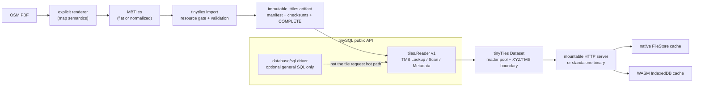

# tinyTiles

🌐 [German version](README.de.md)

`tinyTiles` is a production-oriented toolkit for building, validating, serving
and synchronizing read-only tile sets. It turns an MBTiles source into a
portable `.ttiles` directory backed by tinySQL's paged index, and provides a
separate offline-cache protocol for native clients and WebAssembly.

It is deliberately **not** a claim of 100% MBTiles compatibility. MBTiles is
a SQLite container format; `.ttiles` is a distinct, immutable serving artifact.
Keep MBTiles as the interoperable build output and use tinyTiles where a
validated, SQLite-free read path is useful.

## What is included

- bounded MBTiles import for flat `tiles` and normalized `map/images` sources;
- exact TMS point and spatial-range reads through tinySQL's public API;
- atomic `.ttiles` publication and full post-write validation;
- direct OSM PBF → MBTiles → `.ttiles` orchestration through an explicit
  Karte.Bayern-compatible generator adapter;
- an importable concurrent `Dataset`, a mountable HTTP server and a small
  standalone server binary with automatic vector/raster MIME and URL-extension
  inference, plus durable native and browser IndexedDB caches;
- reproducible tests, race checks, WASM compilation, benchmarks and demos.

## Works well with

tinyTiles is deliberately one narrow layer. It does not compete with any of
the following — it exists so their output has a small, fast, validated read
path once you already have it.

- **[OpenStreetMap](https://www.openstreetmap.org)** is the community-
  maintained source data behind most tile sets tinyTiles serves. `tinytiles
  build` consumes its `.osm.pbf` export format directly, through an explicit
  generator adapter — see [PBF build adapter](#pbf-build-adapter).
- **[Geofabrik](https://download.geofabrik.de)** publishes daily-updated
  `.osm.pbf` extracts for every country and many sub-regions, and is the
  standard source for a `tinytiles build` input. Internal reader benchmarks
  use a Geofabrik extract end to end, from download through published
  artifact.
- **[tippecanoe](https://github.com/felt/tippecanoe)** is the de facto
  standard vector-tile generator for GeoJSON. Its MBTiles output imports
  unchanged; its PMTiles v3 output was used to verify the PMTiles import path
  during development (see [PMTiles sources](#pmtiles-sources)).
- **[PMTiles](https://github.com/protomaps/PMTiles)** archives — from
  tippecanoe, `pmtiles convert`, or any other v3 producer — import directly
  with `tinytiles import`; see [PMTiles sources](#pmtiles-sources). The
  `pmtiles` CLI and [pmtiles.io](https://pmtiles.io) are useful for inspecting
  an archive before import.
- **[MapLibre GL JS](https://maplibre.org)**, Mapbox GL JS, OpenLayers and
  deck.gl all consume the TileJSON tinyTiles serves at `/tilejson.json`,
  including `vector_layers`/`tilestats` for a vector tileset and `encoding`
  for a raster DEM terrain source.
- **[QGIS](https://qgis.org)** can add a tinyTiles endpoint directly as a
  vector or raster tile layer through its TileJSON/XYZ connection dialog —
  useful for inspecting a published artifact without writing client code.

## Quick start

Import, PBF build and SQLite comparison need tinySQL's optional SQLite importer
build tag. A server that only opens an already published `.ttiles` artifact
does not link or open SQLite:

```bash
make build
./dist/tinytiles import --min-free 0 region.mbtiles region.ttiles/
./dist/tinytiles validate region.ttiles/
./dist/tinytiles inspect region.ttiles/
```

For a deployment or recovery host that only reads a published artifact, build
the smaller SQLite-free CLI instead:

```bash
make build-reader-cli
./dist/tinytiles-reader validate region.ttiles/
./dist/tinytiles-reader tile region.ttiles/ 8 137 167 > tile.pbf
```

Its `validate`, `inspect` and `tile` commands work without SQLite. `build`,
`import` and `benchmark` intentionally return a clear build-tag error there.

Build from PBF when a compatible generator is available:

```bash
./dist/tinytiles build \
  --generator /path/to/karte-preprocess \
  --minzoom 8 --maxzoom 14 --building-minzoom 12 \
  --shards 256 --max-memory $((256 * 1024 * 1024)) \
  region.osm.pbf region.ttiles/
```

`build` does not invent a map style. The external generator owns OSM feature
selection, styling and MVT layer semantics; tinyTiles owns the bounded import,
artifact contract and reader/cache path.

Temporary generator shards stay compressed by default to limit workspace disk.
On a fast local SSD with sufficient temporary capacity, pass
`--shard-compression=false` to trade that disk for faster PBF generation; the
choice is recorded in the published artifact provenance.

The same `--compact` flag is available on `tinytiles build`; it deduplicates
the generated MBTiles only for the final `.ttiles` import and does not alter a
requested `--mbtiles-out` file.

## Architecture



The server-side dataset and browser cache have intentionally different storage
formats. A browser never opens SQLite or tinySQL page files; it stores bounded
individual TMS tiles under a versioned cache namespace. That makes the web
path portable and avoids shipping server persistence internals to a client.

## Terminology, abbreviations, and GIS basics

Commands, filenames, and API names retain their conventional English spelling.
This glossary defines their meaning and keeps apart concepts that are easy to
confuse in mapping: a coordinate convention, projection, data format, cache
state, and measurement method are independent concerns.

### Map, tile, and coordinates

| Term | Meaning in tinyTiles |
|---|---|
| **GIS** (geographic information system) | Software and data for capturing, processing, and displaying spatial information. tinyTiles stores and serves map data; it does not define a map design or GIS domain logic. |
| **Tile** | A rectangular part of a map grid. A tile set is usually *sparse*: not every theoretical coordinate has a tile. |
| **Tile coordinate <code>(z, x, y)</code>** | A tile's address in the grid, not latitude/longitude and not pixel coordinates. <code>z</code> is the zoom level, <code>x</code> the column, and <code>y</code> the row. |
| **Zoom level (<code>z</code>)** | The detail level of the grid. In the usual global web-map grid, each level doubles the number of columns and rows, producing roughly four times as many possible tiles and finer detail. |
| **TMS** (Tile Map Service) | A tile-row numbering convention with its origin at the lower left; <code>y</code> increases northward. tinyTiles stores and reads coordinates as TMS. |
| **XYZ** | The numbering convention common in web-map URLs, with its origin at the upper left; <code>y</code> increases southward. At the same zoom and column, TMS and XYZ differ only in the row. <code>LookupXYZ</code> converts that row exactly once; <code>LookupTMS</code> does not. |
| **Row flip** | The conversion between TMS and XYZ. For a complete grid at zoom <code>z</code>, <code>y_tms = 2^z - 1 - y_xyz</code>. A wrong flip often returns a plausible but vertically mirrored tile. |
| **WGS84** (World Geodetic System 1984) | The common global reference system for latitude and longitude. <code>PrefetchRoute</code> accepts WGS84 points and converts them to tiles at the requested zoom. |
| **Latitude/longitude** | Geographic position in degrees: latitude is north/south, longitude east/west. They are not <code>x/y</code> tile coordinates. |
| **Web Mercator** | The projection widely used by web maps behind many XYZ/TMS grids. TMS and XYZ are not projections themselves; the generator determines how source data is projected into its tile grid. |
| **Spatial range** | A query for a rectangular region of several tile coordinates. It differs from a geographic radius even where both appear similar on a map. |
| **Route rasterization** | Translating a line of WGS84 route points into the tiles it crosses. tinyTiles does not render an image in this step; it only determines tile addresses to prefetch. |

### Sources, data formats, and representations

| Term | Meaning |
|---|---|
| **OSM** (OpenStreetMap) | Community-maintained geographic data such as roads, buildings, and properties. OSM is source data, not a finished map design. |
| **PBF** (Protocol Buffers) | A binary encoding of structured data. A <code>.osm.pbf</code> file contains OSM source data. The <code>pbf</code> format of a vector tile also uses Protocol Buffers, but is a map-ready tile with a different kind of content. |
| **MBTiles** | A common tile container based on an SQLite database. tinyTiles uses MBTiles as an interoperable build and exchange format, not as its own serving format. |
| **SQLite / SQL** | SQLite is an embedded database; SQL (Structured Query Language) is its query language. Import and comparison tools read SQLite, while the normal <code>.ttiles</code> read path does not. |
| **<code>.ttiles</code> artifact** | tinyTiles' immutable serving directory: paged tinySQL storage with indexes, a manifest, and integrity files. It is not an MBTiles standard and is not intended to replace MBTiles. |
| **Generator / renderer / map style** | The external generator selects OSM objects, creates tiles, and determines layer and styling semantics for vector tiles. tinyTiles imports and serves its result; it does not invent a style. |
| **Vector tile / MVT** | An **MVT** (Mapbox Vector Tile) contains geometries, layers, and attributes which a client draws with a style. It can deliver roads and buildings as data rather than pixels. |
| **Raster tile** | Pre-rendered pixels, such as PNG (Portable Network Graphics), JPEG/JPG (Joint Photographic Experts Group), WebP, or AVIF (AV1 Image File Format). Aerial imagery is typically raster. The format affects MIME type and URL extension, not the TMS/XYZ convention. |
| **Layer, feature, geometry, attribute** | Parts of a vector tile: a layer groups contents; a feature might be a road; its geometry gives shape and position, while attributes describe properties such as name or class. |
| **Payload / BLOB** | The actual binary bytes of a tile. **BLOB** means “Binary Large Object,” a field for arbitrary bytes. tinyTiles returns the payload unchanged. |
| **Metadata** | Key/value information about a set, such as its tile format or name. It is not the content of an individual tile. |
| **MIME type / Content-Type** | MIME (Multipurpose Internet Mail Extensions) is the HTTP label that tells a client how to treat bytes, such as <code>image/png</code> or <code>application/vnd.mapbox-vector-tile</code>. The server normally derives it from the MBTiles format. |

### Storage layout, import, and integrity

A **schema** is the physical arrangement of the same logical tiles. Selecting
one changes neither coordinates nor the bytes returned for a valid tile.

| Form | Structure | When it is useful |
|---|---|---|
| **flat / <code>tiles</code>** | A coordinate points directly to its payload. | Few or no identical payloads; a lookup needs one fewer index path. |
| **normalized / <code>map/images</code>** | <code>map</code> maps a coordinate to a <code>tile_id</code>; <code>images</code> maps that ID to the payload. | Multiple coordinates share exactly the same payload, avoiding duplicate storage. |

- **<code>tile_id</code>:** The identifier (ID) of a payload in a normalized
  source. It is reusable only if multiple coordinates genuinely yield the
  same bytes.
- **Deduplication:** Identical payloads are stored once and referenced by
  multiple coordinates. **<code>--compact</code>** performs this lossless
  content deduplication during import. “Lossless” means byte-exact: every
  coordinate returns exactly the source bytes, not merely a visually identical
  image.
- **<code>--schema auto</code>:** Selects the flat form when a normalized
  source has no reusable <code>tile_id</code>; otherwise it remains
  normalized. Normalized is therefore not universally smaller or faster.
- **Compression:** Shrinks bytes using an encoding scheme. Deduplication only
  removes already-identical copies. Temporary **shard compression** affects
  generator work files, not tile fidelity. An **SSD** is a fast solid-state
  drive without rotating media; uncompressed shards trade more temporary SSD
  space for less decompression work.
- **Batch:** A bounded group of import rows processed together. It bounds the
  in-memory **working set**—the data currently needed—instead of loading the
  whole source into **RAM** (Random Access Memory).
- **Shard:** A temporary subset or partial file of generator work. Shards
  enable bounded memory use and parallel processing.
- **Preflight / resource gate:** An upfront check of reserved free disk and
  memory. It prevents an import from exhausting the machine while writing.
- **Index, B-tree, page, and pager:** An index finds a coordinate without
  scanning every row. tinySQL lays indexes out in fixed file **pages**; the
  **pager** reads and caches those pages. A **B-tree** is the usual tree-shaped
  index structure. When a large BLOB does not fit in one page,
  **overflow pages** can hold its continuation.
- **Hash index:** A temporary index over a short hash/fingerprint that quickly
  finds identical payload candidates during compact import. tinyTiles also
  checks the complete bytes before reuse, so a random hash collision cannot
  create an incorrect deduplication.
- **Reader and reader pool:** A reader is an independent read handle with a
  page cache. A <code>Dataset</code> groups a bounded number of readers so
  requests can read in parallel. Reader count is a concurrency and memory
  budget, not automatically a count of CPU cores (CPU = Central Processing
  Unit).

An artifact is published only after complete **validation**:

- **Manifest:** A machine-readable description of an artifact's version,
  schema, scope, source, and configuration.
- **Provenance:** The manifest information recording which inputs and generator
  configuration produced the artifact. It deliberately excludes local absolute
  machine paths.
- **Digest / checksum / SHA-256:** A digest is a fixed fingerprint of bytes.
  SHA means Secure Hash Algorithm; 256 denotes the 256-bit hash used here.
  Checksums detect transfer and storage corruption when the expected value is
  trusted. They do not replace signatures or access control: an actor able to
  replace both manifest and checksums could change both.
- **<code>COMPLETE</code>:** Marker file written only after successful
  validation. If it is absent, readers treat the directory as incomplete.
- **Immutable:** A published artifact is never changed in place. A new version
  is built separately as a new **revision**.
- **Atomic publication:** After validation, the new sibling directory becomes
  visible via <code>rename</code>, so readers see either the old or the new
  version, not an intermediate state. <code>fsync</code> asks the operating
  system to persist completed writes; it improves durability but is not a
  blanket power-loss guarantee for every filesystem and hardware combination.
- **<code>--replace</code> and rollback candidate:** <code>--replace</code>
  permits replacing an existing destination. The previous version remains a
  potential fallback until publication succeeds.

### Reading, caching, and benchmark latency

**Latency** is the duration of one request. It differs from **throughput**,
the number of requests a system completes per time unit. A **request corpus**
is the fixed set and order of benchmark requests; results are comparable only
when artifact, corpus, concurrency, hardware, and cache state match.

For analysis, individual latencies are sorted. A **percentile** describes a
position in that distribution:

| Metric | Reading | Why it matters |
|---|---|---|
| **p50** | Median: about 50% of requests are no slower and about 50% are no faster. | The typical case. |
| **p95** | 95% of requests are no slower; the slowest 5% are above it. | Whether almost all user requests meet the target. |
| **p99** | 99% of requests are no slower; only the slowest 1% are above it. | Rare but noticeable outliers in the **tail**, the slow end of the distribution. |

For 1,000 measurements, p50, p95, and p99 correspond approximately to the
500th, 950th, and 990th sorted measurements. The exact rounding or
interpolation is an implementation detail of the benchmark tool. These are
**not averages**: a good p50 can coexist with a poor p99. p99 also requires
many independent measurements; it naturally fluctuates more with a small
corpus.

Time is reported in **ns** (nanoseconds, billionths of a second), **µs**
(microseconds, millionths of a second), or **ms** (milliseconds, thousandths
of a second): 1 ms = 1,000 µs = 1,000,000 ns. **MiB** and **GiB** are binary
storage units: 1 MiB = 1,024² bytes and 1 GiB = 1,024³ bytes. They are not
the same as decimal **MB** and **GB** (10⁶ and 10⁹ bytes respectively).

- **Cache hit / cache miss:** On a hit, required data is already cached; on a
  miss, it must be read or computed again. tinyTiles distinguishes at least
  tile cache, reader/page cache, and operating-system file cache.
- **Warm:** The cache being considered is populated by previous accesses.
  Warm measurements show an important steady-state path, but not a first
  request.
- **Cold:** The cache being considered was not warmed beforehand.
  <code>benchmark --cold-request</code> opens a fresh SQLite connection or a
  fresh one-reader tinyTiles <code>Dataset</code> for every coordinate, so it
  measures a real application-cold request without client-side tile or page
  cache reuse. <code>benchmark --cold</code> instead measures complete fresh
  reader pools at one, four, and eight readers. Neither command can portably
  clear the global operating-system file cache; both are *application-cold*,
  not necessarily physically cold storage reads.
- **Hot path:** The frequently executed route of a tile request. tinyTiles
  avoids general SQLite queries there; validation at open and a cache miss can
  intentionally perform more work.
- **Eviction:** Removing old cache entries when the byte budget is reached. A
  later access can therefore become a miss again.

### Server, browser, and programming interfaces

| Term | Meaning |
|---|---|
| **CLI** (Command-Line Interface) | The <code>tinytiles</code> and <code>tinytiles-server</code> programs run from a shell. <code>stdout</code> is their standard output, so <code>tile</code> writes binary data only to a binary-safe pipe or file. |
| **API** (Application Programming Interface) | A programmable interface, for example <code>tinytiles.Open</code>, <code>LookupTMS</code>, or <code>PrefetchRoute</code>. “Public API” means an intentionally supported application interface rather than an internal storage detail. |
| **<code>Dataset</code>, lookup, scan, and metadata** | A dataset is an opened artifact with a reader pool. Lookup reads one tile address, scan reads a spatial range, and metadata returns set information copied at open time. |
| **Context, interface, and error values** | A Go context carries cancellation and an operation deadline. An interface describes required methods without a concrete implementation. <code>ErrTileNotFound</code> and <code>sql.ErrNoRows</code> both mean no entry exists for the requested tile; neither means the artifact is corrupt. |
| **Build tag / <code>sqliteimport</code>** | A switch at Go compile time. It includes SQLite-based import and comparison features; the reader server is built without it and therefore does not open SQLite. |
| **HTTP, URL, and endpoint** | HTTP (Hypertext Transfer Protocol) is the web request protocol; a URL (Uniform Resource Locator) is an address such as <code>/tiles/{z}/{x}/{y}.mvt</code>; an endpoint is a URL handled by a server handler. A <code>mux</code> (multiplexer) dispatches URLs to the appropriate handlers. |
| **TileJSON** | A JSON description of a tile set for map clients, including a suitable URL template and metadata. JSON means JavaScript Object Notation, a text-based exchange format. |
| **CORS** (Cross-Origin Resource Sharing) | A browser rule that controls which web origins may read an HTTP endpoint. CORS is neither authentication nor authorization. |
| **WASM / WebAssembly** | A binary format and runtime for code in a browser. The tinyTiles WASM module does not use the server pager. |
| **IndexedDB** | Persistent key/value browser storage. The browser stores individual TMS tiles there under a versioned cache namespace and manifest revision. |
| **Native FileStore** | The equivalent persistent local cache for a native client, that is, a program outside the browser. It is not the same storage as IndexedDB. |
| **Synchronization / sync** | Downloading and checking a requested tile range for a new manifest revision. The revision becomes active only after every tile is present and checksum-valid. |
| **Promise** | A JavaScript object representing a result that will arrive later. That is why browser calls use <code>await</code>. |
| **Prefetch / predictive caching** | Reading tiles likely to be needed soon, for example along an already trusted route. It can accelerate follow-up requests but does not replace measuring a true cache miss. |
| **Worker and concurrency** | Background workers perform bounded prefetch or sync tasks in parallel. The bound protects memory, filesystem, and server from unbounded simultaneity. |
| **Authentication, authorization, and rate limiting** | Authentication checks *who* requests; authorization checks *what* that identity may do; rate limiting limits request frequency. The standalone server deliberately does not implement these edge/deployment protections itself. |
| **Race check** | A test using Go's Race Detector to find unintended simultaneous memory access. It does not measure map quality and is not a load benchmark. |

## Commands

```text
tinytiles build      source.osm.pbf[,more.osm.pbf] dataset.ttiles/
tinytiles import     source.mbtiles|source.pmtiles dataset.ttiles/
tinytiles validate   dataset.ttiles/
tinytiles inspect    dataset.ttiles/
tinytiles tile       dataset.ttiles/ z x y
tinytiles benchmark  --source source.mbtiles --artifact dataset.ttiles/
tinytiles version
tinytiles-server     -artifact dataset.ttiles/ -dataset region
```

Every tile coordinate is **TMS** `(z, x, y)`. The tool never silently flips
rows as XYZ. `tile` writes raw tile bytes to stdout or `-out`; use it only in
a binary-safe pipeline.

### Import and resource gates

```bash
./dist/tinytiles import \
  --schema auto \
  --batch 2048 \
  --max-memory $((256 * 1024 * 1024)) \
  --min-free $((8 * 1024 * 1024 * 1024)) \
  source.mbtiles dataset.ttiles/
```

Before writing the destination, import prints source size, tile count,
estimated working set, estimated disk use and available disk. It fails safely
if the configured memory or disk reserve is unavailable. Batches stream rows
directly into the paged index; tiles, source rows and index trees are never
held as one full in-memory collection. `Ctrl-C` is propagated through the PBF
generator and importer and leaves the previous published artifact untouched.

Pass `--batch 0` to opt into automatic batch tuning: it sizes a batch from a
bounded sample of source tiles and the configured `--max-memory`, capped at
8,192 rows. This avoids a second whole-file scan before import while reducing
checkpoint overhead for ordinary tiles; a large sampled tile can select a
smaller bounded batch. The default and every positive `--batch` are used
exactly as requested; tinySQL's complete preflight remains the final memory
and disk gate.

`--schema auto` keeps a flat source flat. For a normalized source it selects a
flat serving artifact when every `tile_id` is used by exactly one coordinate;
this is byte-identical and removes an unnecessary second index lookup. A
source with any reused `tile_id` remains normalized, preserving its payload
deduplication. The importer validates all tile keys, index completeness,
checksums, metadata and tile digests before publication. An existing
destination requires `--replace` and is swapped only after the new artifact
has passed validation.

Pass `--compact` to build a losslessly content-deduplicated normalized
artifact. Equal tile payloads are stored once while every coordinate still
returns its original bytes; the temporary hash index verifies a byte-for-byte
match before reusing a payload. It is most useful for repeated transparent,
ocean or placeholder tiles and uses additional temporary disk while staging.
`--compact` requires `--schema auto` or `--schema normalized` (flat would
discard the deduplication). The command reports deduplicated payload bytes and
the final published artifact size; if most tiles are unique, normalized index
overhead can outweigh the saving.

### PMTiles sources

`import` also accepts a **PMTiles v3** archive, recognized by its header magic
rather than its filename:

```bash
./dist/tinytiles import --min-free 0 region.pmtiles region.ttiles/
```

The default flat import streams the archive directly into `.ttiles`; it does
not create an SQLite or MBTiles staging file. It still uses the ordinary
bounded, validated and atomic publication path. Tile payloads are copied byte
for byte; the one transformation is the required XYZ→TMS row flip, applied
exactly once. Run-length entries are expanded to individual coordinates, and
header/JSON metadata — including `vector_layers`, `tilestats` and a terrain
`encoding` — is mapped onto the metadata table the server relays into
TileJSON. `--compact` and an explicitly normalized destination retain MBTiles
staging because global payload deduplication requires an external index. Only
uncompressed or gzip sections and tile payloads are supported; brotli and zstd
are reported rather than guessed at. Writing PMTiles remains out of scope.
For direct imports, the requested batch is automatically reduced when the
largest source tile would otherwise exceed `--max-memory`; the CLI reports the
resolved value as `batch-adjustment`.

### PBF build adapter

`tinytiles build` invokes an external executable, defaulting to
`karte-preprocess`. Build Karte.Bayern's preprocessor once, or point
`--generator` at a compatible executable:

```bash
cd /path/to/Karte.Bayern
go build -o /path/to/bin/karte-preprocess ./cmd/preprocess

cd /path/to/tinyTiles
./dist/tinytiles build \
  --generator /path/to/bin/karte-preprocess \
  --mbtiles-out region.mbtiles \
  --replace-mbtiles --replace \
  region.osm.pbf region.ttiles/
```

Multiple PBF files are comma-separated. `--min-lat`, `--min-lon`, `--max-lat`,
`--max-lon`, `--center-lat`, `--center-lon` and `--radius-km` are deliberately
passed through as explicit Karte.Bayern adapter options. The checksummed
artifact manifest records portable PBF provenance (input basenames/sizes and
generator configuration), never machine-local absolute paths.

## `.ttiles` artifact contract

```text
dataset.ttiles/
  manifest.json
  database/
  indexes/
  checksums.sha256
  COMPLETE
```

`manifest.json` records artifact/tinySQL versions, physical schema, table and
row counts, index configuration, resource estimate, TMS convention, source
provenance and logical data digests. `checksums.sha256` includes the manifest
and all persisted artifact files. `COMPLETE` is written only after a complete
validation pass. Readers reject missing, partial or corrupt artifacts. Serving
code obtains a `tiles.Reader` through the public API, never a tinySQL internal
pager type.

Publication is a sibling temporary directory followed by validation, fsync and
rename. With `--replace`, a previous artifact is kept as a rollback candidate
until the replacement has been published.

## Import as a Go package

`tinyTiles` has three deliberately equivalent surfaces: the importable
`tinytiles.Dataset`, the mountable `server` package and the
`tinytiles-server` binary. They use the same validated, SQLite-free artifact
reader; choose the surface that fits ownership of the HTTP listener.

```go
import (
    "context"
    "net/http"

    tinytiles "github.com/Karte-Bayern/tinyTiles"
    "github.com/Karte-Bayern/tinyTiles/server"
)

dataset, err := tinytiles.Open(context.Background(), "region.ttiles", tinytiles.OpenOptions{
    Readers: 8,
    MaxMemoryBytes: 16 << 20, // per reader
})
if err != nil { /* fail startup */ }
defer dataset.Close()

// Direct drop-in for Karte.Bayern's existing tileReader interface:
// GetTileXYZ(z, x, y) ([]byte, error), Metadata() (map[string]string, error), Close() error.
var tiles interface {
    GetTileXYZ(int, int, int) ([]byte, error)
    Metadata() (map[string]string, error)
    Close() error
} = dataset

// Or mount a generic XYZ/TileJSON/TMS-sync HTTP surface in an existing mux.
tileServer, err := server.New(server.Config{
    Dataset: dataset, DatasetID: "region",
    PrefetchWorkers: 2, PrefetchQueue: 512, PrefetchMaxTiles: 1024,
})
if err != nil { /* fail startup */ }
defer tileServer.Close()
http.Handle("/tiles/", http.StripPrefix("/tiles/", tileServer.XYZHandler()))

// Call after a trusted routing result is available. It warms the crossed tiles
// plus one neighboring tile at the active navigation zoom in the background.
route := []server.RoutePoint{{Latitude: 48.14, Longitude: 11.58}, {Latitude: 48.18, Longitude: 11.65}}
_, err = tileServer.PrefetchRoute(context.Background(), route, server.RoutePrefetchOptions{
    Zoom: 14, Radius: 1,
})

// Viewport and application-generated predictions use the same bounded,
// de-duplicating queue. Existing warm tiles do not consume queue capacity.
_, err = tileServer.PrefetchXYZRange(context.Background(), server.XYZRange{
    Z: 14, XMin: 8600, XMax: 8602, YMin: 5530, YMax: 5532,
})
```

`Dataset.LookupTMS` and `Dataset.ScanTMS` are explicitly TMS; `LookupXYZ` and
the compatibility `GetTileXYZ` flip the row exactly once at the application
boundary. `Metadata` is read and copied at open time, so ordinary requests do
not scan a metadata table. A missing `GetTileXYZ` lookup returns
`tinytiles.ErrTileNotFound`, which is compatible with `sql.ErrNoRows`.

Karte.Bayern can therefore replace only the opening path with `tinytiles.Open`
and keep its existing cache, TileJSON and handler policy. No tinySQL internal
package, SQLite driver or production configuration is required at serving
time.

## Serve and synchronize offline tiles

Build the reference server and native client:

```bash
make build-server build-native-demo
./dist/tinytiles-server \
  -artifact /path/to/region.ttiles -dataset dach \
  -tile-cache-bytes $((32 * 1024 * 1024)) \
  -cors http://localhost:8081

./dist/tinytiles-native-client \
  -manifest http://localhost:8080/sync/manifest.json \
  -cache ./dach-offline -dataset dach \
  -z 8 -xmin 137 -xmax 138 -ymin 167 -ymax 168
```

`tinytiles-server` is built without `sqliteimport`: it opens only the
validated paged artifact through `tinySQL/tiles`. The `tinytiles` build/import
CLI intentionally retains the tag because it reads SQLite MBTiles input.

The server keeps a byte-bounded 32 MiB immutable tile cache by default. A
cache hit avoids a pager lookup, payload allocation and SHA-256 recomputation.
After payload eviction it retains compact SHA-256 values, so a revisited
uncached tile still avoids rehashing its full body. Concurrent cold requests
for the same tile share one pager read. Set `-tile-cache-bytes -1` on
memory-constrained reader processes to disable it, or choose an explicit byte
budget for the expected working set.

`tilejson.json`, `metadata` and `sync/manifest.json` serve a gzip-compressed
body to a client whose `Accept-Encoding` allows it. The encoding is
precomputed once per published revision, not per request, and only used when
it actually shrinks the response. CORS preflight responses advertise
`Access-Control-Max-Age: 86400`, the maximum both Chromium and Firefox honor,
so a browser map client does not repeat the OPTIONS preflight for every one of
the many small cross-origin tile requests it fires while panning or zooming.

Routing integrations can call `Server.PrefetchRoute` with trusted WGS84 route
points. It rasterizes crossed tiles in route order, optionally warms a small
neighbor radius, and submits at most 1,024 keys to two background workers by
default. The API deliberately has no public HTTP endpoint: route input must be
authorized and rate-limited by the embedding application. `Server.Close` stops
workers before the owning application closes its `Dataset`.

A mobile client synchronizing that same route should use
`offline.RouteSyncRequest` rather than a bounding-rectangle `TileRange`: it
computes the identical corridor with `offline.RouteTileKeys` and downloads
only the tiles the route actually crosses, not everything inside its
bounding box.

Publishing a new revision to a running `tinytiles-server` does not require a
restart: `tinytiles import --replace` followed by `kill -HUP` on the server
process reopens the same artifact path and atomically swaps onto it without
dropping in-flight requests.

The standalone server intentionally has no authentication, authorization, rate
limiting or deployment configuration. It is a correct artifact-serving binary,
not a replacement for an application's edge policy. It exposes XYZ tiles at
`/tiles/{z}/{x}/{y}.{format}`, TileJSON at `/tilejson.json`, metadata at
`/metadata`, and the browser-safe revisioned TMS sync protocol at
`/sync/manifest.json`. The standard MBTiles `format` metadata is translated to
the matching HTTP representation: `pbf`/`mvt` serves
`application/vnd.mapbox-vector-tile` at `.mvt`, while aerial and raster sources
using `png`, `jpg`/`jpeg`, `webp`, `avif`, `gif`, `tif`/`tiff`, `svg`, `json`
or `geojson` serve the matching MIME type and extension. The extension is
optional on the wire — `/tiles/{z}/{x}/{y}` resolves the same tile as
`/tiles/{z}/{x}/{y}.{format}`, which suits Leaflet and OpenLayers clients that
request bare coordinates. TileJSON always advertises the selected URL. Embedded servers
can override either with `server.Config{ContentType: ..., TileExtension: ...}`
for a private representation. See [examples/README.md](examples/README.md) for
the browser demo walkthrough.

For a vector tileset, TileJSON also relays `vector_layers` and `tilestats`
straight from the source MBTiles' standard `json` metadata row when the
generator provided one — the same TileJSON 3.0 fields MapLibre GL JS, Mapbox
GL JS, OpenLayers and other vector-tile frontends already expect, so a client
does not need a side channel to discover a tileset's source-layers. A raster
tileset, or a source with no `json` metadata row, simply omits both fields.

Raster **DEM/terrain** tilesets are supported as elevation data rather than
plain imagery. A DEM tile is an ordinary PNG or WebP, so only its encoding
says how to decode pixels into metres; tinyTiles publishes that as the
TileJSON `encoding` field (`terrarium`, `mapbox` for Terrain-RGB, or
`custom`). It is inferred from a `terrarium`/`terrain-rgb` format name or an
`encoding` metadata row. Terrain sources commonly record only `format=png`, so
an existing tileset can be declared without rebuilding it:

```bash
./dist/tinytiles-server \
  -artifact /srv/tiles/dem.ttiles -dataset dem \
  -dem-encoding terrarium
```

Embedded servers use `server.Config{DEMEncoding: "terrarium"}`. The tile bytes
and media type stay exactly those of the underlying raster.

### Browser/WASM cache

```bash
make wasm-package
make serve-wasm
```

The browser API is promise-based:

```js
await tinyTiles.open("dach-offline");
await tinyTiles.sync("https://tiles.example/sync/manifest.json", {
  dataset: "dach",
  ranges: [{ z: 8, x_min: 137, x_max: 138, y_min: 167, y_max: 168 }],
  concurrency: 4,
  prune_previous: false
});
const tile = await tinyTiles.get("dach", 8, 137, 167);
```

Synchronization streams a range into at most 32 workers, writes tiles under
an immutable manifest revision, and switches the active local manifest only
after every requested tile is present and checksum-valid. If it is interrupted,
the old revision stays active and a later sync reuses valid tiles already
stored for the new revision.

A client that calls `Sync` periodically to check for a new revision usually
finds the dataset unchanged. Set `SyncRequest.Dataset` and the native
`Synchronizer` automatically revalidates the cached manifest with a
conditional request instead of re-downloading it in full every time — a `304`
response costs a small fraction of the bytes a full manifest body does.
