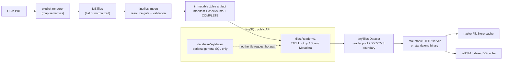

# tinyTiles

`tinyTiles` is a production-oriented toolkit for building, validating, serving
and synchronizing read-only tile sets. It turns an MBTiles source into a
portable `.ttiles` directory backed by tinySQL's paged index, and provides a
separate offline-cache protocol for native clients and WebAssembly.

It is deliberately **not** a claim of 100% MBTiles compatibility. MBTiles is
a SQLite container format; `.ttiles` is a distinct, immutable serving artifact.
Keep MBTiles as the interoperable build output and use tinyTiles where a
validated, SQLite-free read path is useful.

## What is included

- bounded MBTiles import for flat `tiles` and normalized `map/images` sources;
- exact TMS point and spatial-range reads through tinySQL's public API;
- atomic `.ttiles` publication and full post-write validation;
- direct OSM PBF → MBTiles → `.ttiles` orchestration through an explicit
  Karte.Bayern-compatible generator adapter;
- an importable concurrent `Dataset`, a mountable HTTP server and a small
  standalone server binary, plus durable native and browser IndexedDB caches;
- reproducible tests, race checks, WASM compilation, benchmarks and demos.

## Quick start

Import, PBF build and SQLite comparison need tinySQL's optional SQLite importer
build tag. A server that only opens an already published `.ttiles` artifact
does not link or open SQLite:

```bash
make build
./dist/tinytiles import --min-free 0 region.mbtiles region.ttiles/
./dist/tinytiles validate region.ttiles/
./dist/tinytiles inspect region.ttiles/
```

For a deployment or recovery host that only reads a published artifact, build
the smaller SQLite-free CLI instead:

```bash
make build-reader-cli
./dist/tinytiles-reader validate region.ttiles/
./dist/tinytiles-reader tile region.ttiles/ 8 137 167 > tile.pbf
```

Its `validate`, `inspect` and `tile` commands work without SQLite. `build`,
`import` and `benchmark` intentionally return a clear build-tag error there.

Build from PBF when a compatible generator is available:

```bash
./dist/tinytiles build \
  --generator /path/to/karte-preprocess \
  --minzoom 8 --maxzoom 14 --building-minzoom 12 \
  --shards 256 --max-memory $((256 * 1024 * 1024)) \
  region.osm.pbf region.ttiles/
```

`build` does not invent a map style. The external generator owns OSM feature
selection, styling and MVT layer semantics; tinyTiles owns the bounded import,
artifact contract and reader/cache path.

## Architecture



The server-side dataset and browser cache have intentionally different storage
formats. A browser never opens SQLite or tinySQL page files; it stores bounded
individual TMS tiles under a versioned cache namespace. That makes the web
path portable and avoids shipping server persistence internals to a client.

## Commands

```text
tinytiles build      source.osm.pbf[,more.osm.pbf] dataset.ttiles/
tinytiles import     source.mbtiles dataset.ttiles/
tinytiles validate   dataset.ttiles/
tinytiles inspect    dataset.ttiles/
tinytiles tile       dataset.ttiles/ z x y
tinytiles benchmark  --source source.mbtiles --artifact dataset.ttiles/
tinytiles version
tinytiles-server     -artifact dataset.ttiles/ -dataset region
```

Every tile coordinate is **TMS** `(z, x, y)`. The tool never silently flips
rows as XYZ. `tile` writes raw tile bytes to stdout or `-out`; use it only in
a binary-safe pipeline.

### Import and resource gates

```bash
./dist/tinytiles import \
  --schema auto \
  --batch 2048 \
  --max-memory $((256 * 1024 * 1024)) \
  --min-free $((8 * 1024 * 1024 * 1024)) \
  source.mbtiles dataset.ttiles/
```

Before writing the destination, import prints source size, tile count,
estimated working set, estimated disk use and available disk. It fails safely
if the configured memory or disk reserve is unavailable. Batches stream rows
directly into the paged index; tiles, source rows and index trees are never
held as one full in-memory collection. `Ctrl-C` is propagated through the PBF
generator and importer and leaves the previous published artifact untouched.

`--schema auto` preserves the source's flat or normalized shape. The importer
validates all tile keys, index completeness, checksums, metadata and tile
digests before publication. An existing destination requires `--replace` and
is swapped only after the new artifact has passed validation.

### PBF build adapter

`tinytiles build` invokes an external executable, defaulting to
`karte-preprocess`. Build Karte.Bayern's preprocessor once, or point
`--generator` at a compatible executable:

```bash
cd /path/to/Karte.Bayern
go build -o /path/to/bin/karte-preprocess ./cmd/preprocess

cd /path/to/tinyTiles
./dist/tinytiles build \
  --generator /path/to/bin/karte-preprocess \
  --mbtiles-out region.mbtiles \
  --replace-mbtiles --replace \
  region.osm.pbf region.ttiles/
```

Multiple PBF files are comma-separated. `--min-lat`, `--min-lon`, `--max-lat`,
`--max-lon`, `--center-lat`, `--center-lon` and `--radius-km` are deliberately
passed through as explicit Karte.Bayern adapter options. The checksummed
artifact manifest records portable PBF provenance (input basenames/sizes and
generator configuration), never machine-local absolute paths.

## `.ttiles` artifact contract

```text
dataset.ttiles/
  manifest.json
  database/
  indexes/
  checksums.sha256
  COMPLETE
```

`manifest.json` records artifact/tinySQL versions, physical schema, table and
row counts, index configuration, resource estimate, TMS convention, source
provenance and logical data digests. `checksums.sha256` includes the manifest
and all persisted artifact files. `COMPLETE` is written only after a complete
validation pass. Readers reject missing, partial or corrupt artifacts. Serving
code obtains a `tiles.Reader` through the public API, never a tinySQL internal
pager type.

Publication is a sibling temporary directory followed by validation, fsync and
rename. With `--replace`, a previous artifact is kept as a rollback candidate
until the replacement has been published.

## Import as a Go package

`tinyTiles` has three deliberately equivalent surfaces: the importable
`tinytiles.Dataset`, the mountable `server` package and the
`tinytiles-server` binary. They use the same validated, SQLite-free artifact
reader; choose the surface that fits ownership of the HTTP listener.

```go
import (
    "context"
    "net/http"

    tinytiles "github.com/Karte-Bayern/tinyTiles"
    "github.com/Karte-Bayern/tinyTiles/server"
)

dataset, err := tinytiles.Open(context.Background(), "region.ttiles", tinytiles.OpenOptions{
    Readers: 8,
    MaxMemoryBytes: 16 << 20, // per reader
})
if err != nil { /* fail startup */ }
defer dataset.Close()

// Direct drop-in for Karte.Bayern's existing tileReader interface:
// GetTileXYZ(z, x, y) ([]byte, error), Metadata() (map[string]string, error), Close() error.
var tiles interface {
    GetTileXYZ(int, int, int) ([]byte, error)
    Metadata() (map[string]string, error)
    Close() error
} = dataset

// Or mount a generic XYZ/TileJSON/TMS-sync HTTP surface in an existing mux.
tileServer, err := server.New(server.Config{Dataset: dataset, DatasetID: "region"})
if err != nil { /* fail startup */ }
http.Handle("/tiles/", http.StripPrefix("/tiles/", tileServer.XYZHandler()))
```

`Dataset.LookupTMS` and `Dataset.ScanTMS` are explicitly TMS; `LookupXYZ` and
the compatibility `GetTileXYZ` flip the row exactly once at the application
boundary. `Metadata` is read and copied at open time, so ordinary requests do
not scan a metadata table. A missing `GetTileXYZ` lookup returns
`tinytiles.ErrTileNotFound`, which is compatible with `sql.ErrNoRows`.

Karte.Bayern can therefore replace only the opening path with `tinytiles.Open`
and keep its existing cache, TileJSON and handler policy. No tinySQL internal
package, SQLite driver or production configuration is required at serving
time.

## Serve and synchronize offline tiles

Build the reference server and native client:

```bash
make build-server build-native-demo
./dist/tinytiles-server \
  -artifact /path/to/region.ttiles -dataset dach \
  -cors http://localhost:8081

./dist/tinytiles-native-client \
  -manifest http://localhost:8080/sync/manifest.json \
  -cache ./dach-offline -dataset dach \
  -z 8 -xmin 137 -xmax 138 -ymin 167 -ymax 168
```

`tinytiles-server` is built without `sqliteimport`: it opens only the
validated paged artifact through `tinySQL/tiles`. The `tinytiles` build/import
CLI intentionally retains the tag because it reads SQLite MBTiles input.

The standalone server intentionally has no authentication, authorization, rate
limiting or deployment configuration. It is a correct artifact-serving binary,
not a replacement for an application's edge policy. It exposes XYZ tiles at
`/tiles/{z}/{x}/{y}.mvt`, TileJSON at `/tilejson.json`, metadata at
`/metadata`, and the browser-safe revisioned TMS sync protocol at
`/sync/manifest.json`. See [examples/README.md](examples/README.md) for the
browser demo walkthrough.

### Browser/WASM cache

```bash
make wasm-package
make serve-wasm
```

The browser API is promise-based:

```js
await tinyTiles.open("dach-offline");
await tinyTiles.sync("https://tiles.example/sync/manifest.json", {
  dataset: "dach",
  ranges: [{ z: 8, x_min: 137, x_max: 138, y_min: 167, y_max: 168 }],
  concurrency: 4,
  prune_previous: false
});
const tile = await tinyTiles.get("dach", 8, 137, 167);
```

Synchronization streams a range into at most 32 workers, writes tiles under
an immutable manifest revision, and switches the active local manifest only
after every requested tile is present and checksum-valid. If it is interrupted,
the old revision stays active and a later sync reuses valid tiles already
stored for the new revision.